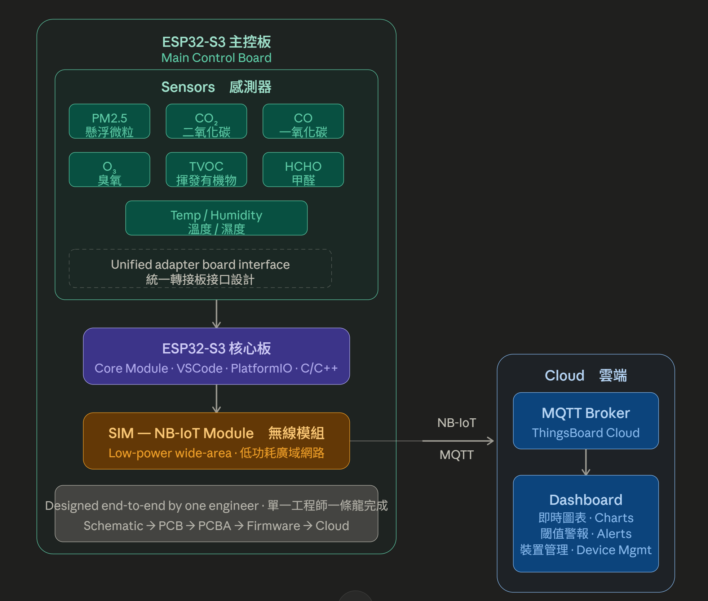
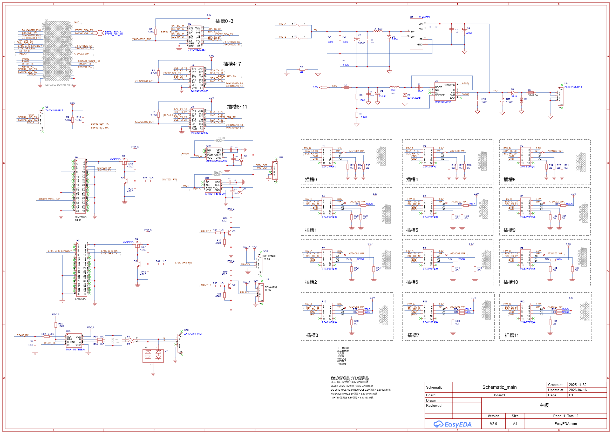

# 🌬️ ESP32 AirQuality Prj

> End-to-end indoor air quality monitoring system — from schematic design to cloud dashboard, built solo.
>
> 室內空氣品質監測系統，從線路圖設計到雲端 Dashboard，全程一人獨立完成。


---

## 📌 Overview / 專案概述

A compact, multi-sensor air quality monitoring device based on ESP32, designed for indoor deployment. Sensor data is transmitted over NB-IoT via MQTT to a ThingsBoard cloud dashboard for real-time visualization and alerting.

This project was developed **end-to-end by a single engineer** — covering hardware schematic, PCB layout, firmware development, and cloud dashboard configuration.

基於 ESP32 的多感測器室內空氣品質監測裝置，感測數據透過 NB-IoT 以 MQTT 協定上傳至 ThingsBoard 雲端 Dashboard，提供即時數據視覺化與警報功能。

本專案由**單一工程師一條龍獨立完成**，涵蓋硬體線路圖、PCB Layout、韌體開發及雲端 Dashboard 建置。

---

## 🏗️ System Architecture / 系統架構

```
┌─────────────────────────────────┐
│           ESP32 Device          │
│                                 │
│  ┌──────────┐  ┌─────────────┐  │
│  │ Sensors  │  │  SIM (NB-IoT│  │
│  │ PM2.5    │  │   Module)   │  │
│  │ CO2      │  └──────┬──────┘  │
│  │ CO       │         │MQTT     │
│  │ O3       │         │         │
│  │ TVOC     │         │         │
│  │ HCHO     │         │         │
│  │ Temp/Hum │         │         │
│  └──────────┘         │         │
└─────────────────────────────────┘
                         │
                    [ NB-IoT ]
                         │
                  ┌──────▼──────┐
                  │ ThingsBoard │
                  │   Cloud     │
                  │  Dashboard  │
                  └─────────────┘
```

 

---

## ✨ Features / 功能特色

- **Multi-gas sensing** — simultaneous monitoring of PM2.5, CO₂, CO, O₃, TVOC, HCHO, Temperature & Humidity
  **多氣體同步監測** — 同時偵測 PM2.5、CO₂、CO、O₃、TVOC、HCHO、溫度與濕度

- **Unified sensor interface** — custom adapter board with standardized connector for all gas sensor modules
  **統一感測器接口** — 自製轉接板，所有氣體感測模組採用標準化連接器設計

- **NB-IoT connectivity** — low-power wide-area network transmission via SIM module
  **NB-IoT 無線傳輸** — 透過 SIM 模組進行低功耗廣域網路傳輸

- **MQTT protocol** — lightweight, reliable data publishing to cloud broker
  **MQTT 協定** — 輕量可靠的數據發布機制

- **ThingsBoard dashboard** — real-time charts, threshold alerts, and device management
  **ThingsBoard Dashboard** — 即時圖表、閾值警報與裝置管理

- **Compact PCB design** — all components integrated on a custom-designed board
  **緊湊 PCB 設計** — 所有元件整合於自行設計的電路板

---

## 🔧 Hardware Design / 硬體設計

### Schematic / 線路圖



### PCB Layout

> 📷 _Place PCB layout screenshot here / 放置 PCB Layout 截圖_
> ``

### 3D PCB View / 3D PCB 視圖

> 📷 _Place 3D PCB render here / 放置 3D PCB 圖_
> ``

### Assembled Board / 實體板子

> 📷 _Place physical board photo here / 放置實體板子照片_
> ``

### Sensor Modules / 感測器模組

| Sensor / 感測器 | Target / 偵測項目 |
|----------------|------------------|
| Particulate sensor | PM2.5 |
| NDIR / Electrochemical | CO₂ |
| Electrochemical | CO |
| Electrochemical | O₃ |
| MOX sensor | TVOC |
| Electrochemical | HCHO |
| Digital sensor | Temperature & Humidity / 溫濕度 |

> All sensor modules connect through a **unified adapter board interface**, simplifying swapping and testing.
>
> 所有感測器模組均透過**統一轉接板接口**連接，方便替換與測試。

---

## 💻 Firmware Development / 韌體開發

### Environment / 開發環境

| Tool / 工具 | Details / 說明 |
|-------------|---------------|
| IDE | Visual Studio Code |
| Framework | PlatformIO |
| Target MCU | ESP32 |
| Language | C / C++ |

### Development Environment Screenshot / 開發環境截圖

> 📷 _Place VSCode + PlatformIO screenshot here / 放置 VSCode + PlatformIO 截圖_
> ``

### Key Firmware Responsibilities / 韌體主要功能

- Sensor initialization and polling loop
  感測器初始化與輪詢迴圈

- Unified sensor data struct for multi-sensor aggregation
  多感測器統一資料結構彙整

- NB-IoT SIM module AT command control
  NB-IoT SIM 模組 AT 指令控制

- MQTT client — connect, publish, reconnect logic
  MQTT 客戶端 — 連線、發布、重連邏輯

- Watchdog and error recovery
  看門狗與錯誤恢復機制

> ⚠️ Firmware source code is proprietary and not included in this repository.
>
> ⚠️ 韌體原始碼為公司財產，不包含於此 Repository。

---

## ☁️ Cloud & Connectivity / 雲端與連線

### NB-IoT + MQTT

- Device connects to network via NB-IoT SIM module
  裝置透過 NB-IoT SIM 模組連接網路

- Data published to ThingsBoard MQTT broker at configurable intervals
  數據依設定間隔發布至 ThingsBoard MQTT Broker

- Telemetry keys mapped per sensor channel
  每個感測器通道對應獨立遙測 Key

### ThingsBoard Dashboard

> 📷 _Place ThingsBoard dashboard screenshot here / 放置 ThingsBoard Dashboard 截圖_
> ``

Dashboard features / Dashboard 功能：
- Real-time time-series charts per gas channel / 各氣體通道即時時序圖表
- Color-coded threshold indicators / 顏色編碼閾值警示
- Multi-device management panel / 多裝置管理面板

> ⚠️ Dashboard configuration and tenant credentials are not included.
>
> ⚠️ Dashboard 設定與帳戶資訊不包含於此 Repository。

---

## 🛠️ Development Scope / 開發範疇

This project was designed and built **entirely by one engineer**.
本專案由**單一工程師獨立完成**所有階段。

| Phase / 階段 | Scope / 內容 |
|-------------|-------------|
| 🖊️ Schematic Design / 線路圖設計 | Full circuit schematic, component selection / 完整電路設計、元件選型 |
| 🟩 PCB Layout | Multi-layer PCB design, DFM review / 多層板設計、可製造性審查 |
| 🏭 PCBA | Board bring-up and hardware validation / 板子量測與硬體驗證 |
| ⚙️ Firmware / 韌體 | Sensor drivers, MQTT stack, NB-IoT integration / 感測器驅動、MQTT、NB-IoT 整合 |
| ☁️ Cloud / 雲端 | ThingsBoard device provisioning and dashboard / 裝置佈建與 Dashboard 建置 |

---

## 📁 Repository Contents / Repository 結構

```
ESP32-AirQuality-Prj/
├── assets/                  # Screenshots, photos, diagrams / 截圖、照片、圖表
│   ├── schematic.png
│   ├── pcb_layout.png
│   ├── pcb_3d.png
│   ├── board_photo.jpg
│   ├── ide_vscode.png
│   └── dashboard.png
└── README.md
```

> Source code and dashboard configuration are proprietary and excluded from this repository.
>
> 原始碼與 Dashboard 設定為公司財產，不包含於此 Repository。

---

## 📬 Contact / 聯絡方式

If you're interested in commissioning similar embedded systems or IoT projects, feel free to reach out.

如果您對委託類似的嵌入式系統或 IoT 專案有興趣，歡迎與我聯絡。

> _[ Your name / GitHub profile / email / LinkedIn ]_
